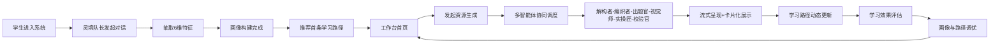

# 智学灵境 EduVerse — 高等教育个性化学习多智能体系统 PRD

## 1. 产品概述

智学灵境 EduVerse 是面向高等教育场景的"多智能体协同"个性化学习平台。系统以"人工智能"专业课程为切入点，通过 6 个角色化智能体协作，自动构建学生动态画像、生成多模态学习资源（讲解文档 / 思维导图 / 题库 / 拓展阅读 / 教学动画 / 代码实操）、规划个性化学习路径并提供即时辅导与学习效果评估，真正落地"因材施教"。

- **目标用户**：高校人工智能 / 计算机 / 电子信息相关专业本科生与研究生
- **核心价值**：突破标准化教学局限，将大模型、多模态生成、多智能体协同融合为可被每位学生使用的"专属 AI 学习助理"
- **市场价值**：可作为高校智慧教育平台、教辅 SaaS、个性化学习引擎的核心组件

## 2. 核心功能

### 2.1 用户角色

| 角色 | 进入方式 | 核心权限 |
|------|---------|----------|
| 学生 | 首次进入通过对话式引导注册 | 画像构建、资源生成、路径规划、智能辅导、效果评估 |
| 访客预览 | 一键体验 | 浏览预置 Demo 数据，不可生成新资源 |

### 2.2 功能模块

1. **工作台首页**：智能体编队可视化、当日学习仪表盘、快捷入口
2. **学习画像**：对话式画像构建 + 6 维度雷达图 + 动态更新时间线
3. **资源工坊**：多智能体协同生成 6 类多模态资源（流式呈现）
4. **学习路径**：动态路径图谱、节点资源卡、进度追踪
5. **智能辅导**：多模态答疑对话（文字 + 图解 + 短视频卡片）
6. **学习评估**：多维度效果雷达、知识掌握热力图、智能调优建议
7. **资源中心**：已生成资源统一检索与卡片化浏览

### 2.3 页面详情

| 页面名称 | 模块名称 | 功能描述 |
|---------|---------|---------|
| 工作台首页 | 智能体编队 | 6 个智能体头像与职责展示，悬浮查看协作链路 |
| 工作台首页 | 学习仪表盘 | 今日任务、学习时长、掌握度环形图、待办资源 |
| 工作台首页 | 快捷入口 | 一键发起画像更新 / 资源生成 / 答疑 / 评估 |
| 学习画像 | 对话构建 | 流式对话气泡、抽取特征实时高亮、画像进度环 |
| 学习画像 | 6 维雷达图 | 知识基础 / 认知风格 / 易错偏好 / 学习节奏 / 兴趣方向 / 目标导向 |
| 学习画像 | 更新时间线 | 历次画像变更记录，支持版本对比 |
| 资源工坊 | 智能体调度台 | 选择资源类型 → 触发对应智能体编队 |
| 资源工坊 | 流式生成区 | Markdown 流式渲染 + 进度追踪 + 多模态卡片 |
| 资源工坊 | 智能体协作日志 | 实时显示各智能体"思考-生成-校验"过程 |
| 学习路径 | 路径图谱 | 节点-连线 SVG 图谱，节点状态色（未学/进行/已学/推荐） |
| 学习路径 | 节点资源抽屉 | 点击节点查看关联资源卡片 |
| 学习路径 | 动态调优 | 大模型给出跳级 / 补强建议 |
| 智能辅导 | 答疑对话 | 流式文字 + 图解卡片 + 短视频讲解卡 |
| 智能辅导 | 上下文记忆 | 显示当前问题对应知识点与画像影响 |
| 学习评估 | 效果雷达 | 5 维评估（掌握度/熟练度/迁移力/坚持度/创新力） |
| 学习评估 | 热力图 | 知识点掌握热力网格 |
| 学习评估 | 调优建议 | 大模型生成的资源推送策略调整方案 |
| 资源中心 | 卡片瀑布流 | 6 类资源混合瀑布流 + 类型筛选 + 收藏 |

## 3. 核心流程

### 3.1 学生首次进入流程
用户打开系统 → 智能体队长「灵境」主动发起对话 → 通过 5-8 轮自然语言对话抽取特征 → 实时构建 6 维画像 → 推荐首条学习路径 → 进入工作台。

### 3.2 多智能体资源生成流程
学生选择资源类型与主题 → 调度中心分配智能体编队 →「解构者」拆解知识结构 →「编织者」生成内容主体 →「出题官」生成题目 →「视觉师」生成图解 / 动画脚本 →「实操匠」生成代码案例 →「校验官」防幻觉与安全过滤 → 流式输出至学生。

### 3.3 学习路径动态调优流程
学习行为数据采集 → 评估智能体生成效果雷达 → 比对画像目标 → 路径规划智能体给出跳级 / 补强 / 复习建议 → 节点状态更新 → 推送新资源。

## 4. 用户界面设计

### 4.1 设计风格

- **整体调性**：「东方智学 × 未来学术」— 以墨色与宣纸为底，叠加流光霓虹与几何粒子，营造"古今交融的智能学院"氛围
- **主色调**：
  - 背景：墨黑 `#0A0E1A` / 宣纸 `#F5F1E8`（双主题切换）
  - 主色：朱砂红 `#E63946` + 青金 `#1B9AAA`
  - 强调色：流光金 `#F4A261` + 紫宸 `#9D4EDD`
- **字体**：
  - 显示字体：`Noto Serif SC`（思源宋体）— 用于标题，呈现学术庄重感
  - 正文：`Noto Sans SC` + `JetBrains Mono`（代码）
- **按钮风格**：胶囊圆角 + 玻璃态背景 + 微光悬浮
- **布局风格**：左侧固定智能体编队栏 + 主内容卡片化 + 顶部流光导航
- **图标/Emoji**：统一使用 `lucide-react` 线性图标，禁用 emoji
- **动效**：粒子背景、智能体"呼吸光"、流式打字机、卡片浮入、雷达图绘制动画

### 4.2 页面设计概览

| 页面名称 | 模块名称 | UI 元素 |
|---------|---------|---------|
| 工作台首页 | Hero 区 | 粒子背景 + 智能体编队环形排列 + 呼吸光晕 |
| 工作台首页 | 仪表盘 | 玻璃卡片 + 环形进度 + 数字滚动动画 |
| 学习画像 | 对话区 | 左侧流式气泡 + 右侧画像实时构建 |
| 学习画像 | 雷达图 | SVG 六维雷达 + 绘制动画 + 维度悬浮详情 |
| 资源工坊 | 调度台 | 智能体头像卡片矩阵 + 类型选择芯片 |
| 资源工坊 | 流式区 | 打字机 + Markdown 渲染 + 多模态卡片 |
| 学习路径 | 图谱 | SVG 节点连线 + 状态色 + 路径流动光效 |
| 智能辅导 | 对话 | 双栏对话 + 图解卡片 + 视频缩略卡 |
| 学习评估 | 雷达+热力图 | 五维雷达 + 网格热力 + 建议气泡 |
| 资源中心 | 瀑布流 | CSS Columns 瀑布流 + 类型筛选 + 悬浮放大 |

### 4.3 响应式

桌面优先（≥1280px 主体验），平板（768-1280px）自适应折叠侧栏，移动端（<768px）单列卡片堆叠，触控目标 ≥44px。

### 4.4 多模态卡片视觉

- 文档卡：宋体标题 + 摘要 + 阅读时长徽章
- 思维导图卡：SVG 缩略图 + 节点数统计
- 题库卡：题型徽章 + 难度星标 + 首题预览
- 拓展阅读卡：来源标签 + 引用数 + 关联知识点
- 教学动画卡：分镜缩略图 + 时长 + 播放按钮
- 代码实操卡：代码片段高亮 + 运行环境徽章 + 一键复制
