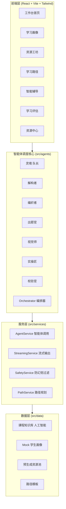
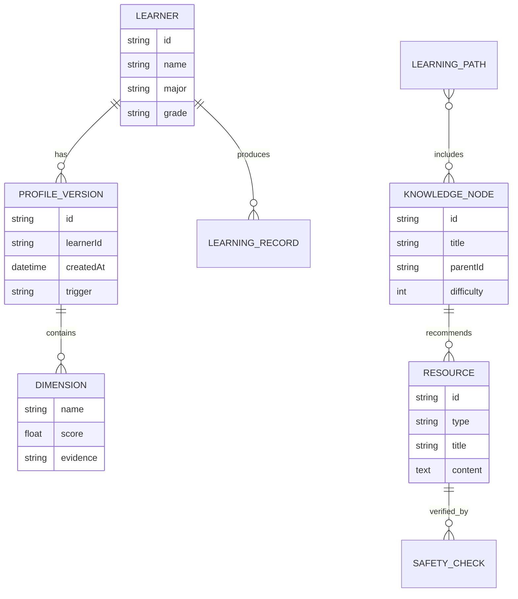

# 智学灵境 EduVerse 技术架构文档

## 1. 架构设计



## 2. 技术说明

- **前端**：React 18 + TypeScript + Vite 5 + Tailwind CSS 3
- **路由**：react-router-dom v6
- **状态管理**：zustand（轻量、hook 友好）
- **图标**：lucide-react
- **Markdown 渲染**：react-markdown + remark-gfm + rehype-highlight
- **动效**：framer-motion + CSS keyframes
- **初始化工具**：vite-init（react-ts 模板）
- **后端**：无（Demo 用 Mock 数据 + 前端模拟流式输出，符合赛题"开发环境不限"且保证可独立运行）
- **数据库**：无（内存 + 静态 JSON 数据，便于评审一键运行）
- **大模型接入预留**：`AgentService` 内置 `provider` 抽象，可平滑切换至科大讯飞星火 / OpenAI / Claude；Demo 默认使用本地"剧本式"流式回放，保证演示稳定。

## 3. 智能体角色定义

| 智能体 | 代号 | 职责 | 触发场景 |
|--------|------|------|---------|
| 灵境 | Captain | 对话引导、画像构建、任务分发 | 首次进入 / 画像更新 |
| 解构者 | Deconstructor | 知识点拆解、思维导图骨架 | 文档 / 思维导图 / 路径生成 |
| 编织者 | Weaver | 内容主体撰写、拓展阅读 | 讲解文档 / 拓展阅读 |
| 出题官 | QuizMaster | 题目生成、难度分级 | 题库资源 |
| 视觉师 | Visualist | 图解 SVG、动画分镜脚本 | 教学动画 / 图解 |
| 实操匠 | Coder | 代码案例、可运行片段 | 代码实操 |
| 校验官 | Validator | 事实核查、安全过滤、引用补全 | 所有资源生成末段 |

## 4. 路由定义

| 路由 | 用途 |
|------|------|
| `/` | 工作台首页（仪表盘 + 智能体编队） |
| `/profile` | 学习画像构建与查看 |
| `/workshop` | 资源工坊（多智能体生成） |
| `/path` | 学习路径图谱 |
| `/tutor` | 智能辅导对话 |
| `/assessment` | 学习效果评估 |
| `/library` | 资源中心 |
| `/onboarding` | 首次对话引导（覆盖式弹层） |

## 5. API 设计（前端服务层抽象）

> Demo 阶段所有"API"为本地异步函数，模拟网络延迟与流式输出。生产可替换为真实 HTTP。

```typescript
// 智能体调度
interface AgentTask {
  taskId: string
  resourceType: 'document' | 'mindmap' | 'quiz' | 'reading' | 'animation' | 'code'
  topic: string
  learnerId: string
}

interface AgentLogEntry {
  agentId: string
  agentName: string
  phase: 'thinking' | 'generating' | 'validating' | 'done'
  message: string
  ts: number
}

interface ResourceGenerated {
  id: string
  type: AgentTask['resourceType']
  title: string
  content: string           // markdown / svg / code
  metadata: {
    duration?: number       // 阅读时长 / 视频时长
    difficulty?: 1 | 2 | 3 | 4 | 5
    knowledgePoints: string[]
    citations?: string[]
  }
  safetyCheck: { passed: boolean; flags: string[] }
}

// 服务接口
interface AgentService {
  orchestrate(task: AgentTask, onLog: (e: AgentLogEntry) => void): AsyncIterable<string>
  validate(content: string): Promise<{ passed: boolean; flags: string[] }>
}
```

## 6. 数据模型

### 6.1 ER 图



### 6.2 学生画像 6 维度定义

| 维度 | 取值范围 | 数据来源 | 示例 |
|------|---------|---------|------|
| 知识基础 | 0-100 | 对话自评 + 测验 | 高数 78 / 线代 65 |
| 认知风格 | {视觉, 听觉, 实践, 抽象} | 对话偏好 | 视觉+实践 |
| 易错偏好 | 标签集合 | 历史错题 | "梯度爆炸 / 边界条件" |
| 学习节奏 | {疾风, 稳健, 沉浸} | 时长统计 | 稳健 |
| 兴趣方向 | 标签集合 | 对话选择 | "CV / 大模型推理" |
| 目标导向 | {应试, 科研, 工程, 兴趣} | 对话目标 | 科研+工程 |

### 6.3 预置课程知识库（人工智能）

预置 1 门完整课程：**《人工智能导论》**，共 6 章 / 24 知识点：

1. AI 绪论与发展史
2. 搜索与优化（A* / 启发式 / 遗传算法）
3. 知识表示与推理（谓词逻辑 / 知识图谱）
4. 机器学习基础（监督 / 无监督 / 评估）
5. 深度学习（CNN / RNN / Transformer）
6. 大模型与多智能体（LLM / Agent / RAG）

每知识点预置：1 篇讲解文档、1 张思维导图、1 套题库（5 题）、1 篇拓展阅读、1 段动画脚本、1 个代码案例，共 24×6 = 144 条预生成资源作为系统输入。

### 6.4 防幻觉与安全过滤机制

- **校验官** 在每条资源生成末段执行：
  1. 关键事实对照本地知识库（白名单知识点）
  2. 公式 / 代码语法校验
  3. 敏感词过滤（内置词表）
  4. 引用补全（缺失引用则标注"待补充"）
- 不通过则打回重生成（最多 2 次），仍不通过则降级为"草稿"标签展示。

## 7. 流式输出实现

- `StreamingService` 基于 `async function*` 生成器逐 token 产出文本。
- 前端通过 `for await` 消费并 setState 追加，配合 30ms 节流渲染打字机效果。
- 多模态卡片在文本流中通过约定标记 `[CARD:type:id]` 占位，渲染时替换为对应卡片组件。

## 8. 视觉与交互规范

- 双主题：默认深色「墨夜」，可切浅色「宣纸」。
- 字体：标题 `Noto Serif SC` 600/700；正文 `Noto Sans SC` 400/500；代码 `JetBrains Mono`。
- 间距：4 / 8 / 12 / 16 / 24 / 32 / 48 / 64 倍数体系。
- 圆角：卡片 16px、按钮 9999px、徽章 6px。
- 阴影：`0 8px 32px rgba(0,0,0,.4)` 主卡片；悬浮 `0 16px 48px`。
- 动效时长：120ms（hover）/ 240ms（卡片入场）/ 600ms（雷达绘制）。

## 9. 防白屏等待策略

- 所有生成任务显示"生成进度追踪条"（基于 token 计数 / 总预估）。
- 智能体协作日志实时滚动，让用户感知后台工作。
- 超过 3s 未首字输出，自动显示"正在调用智能体编队…"骨架。
- 多模态卡片采用渐进式占位 → 内容填充。

## 10. 开源依赖与协议声明

| 依赖 | 用途 | 协议 |
|------|------|------|
| React 18 | UI 框架 | MIT |
| Vite 5 | 构建工具 | MIT |
| Tailwind CSS 3 | 原子化 CSS | MIT |
| zustand | 状态管理 | MIT |
| react-router-dom | 路由 | MIT |
| framer-motion | 动效 | MIT |
| react-markdown | Markdown 渲染 | MIT |
| remark-gfm / rehype-highlight | MD 扩展 | MIT |
| lucide-react | 图标 | ISC |

> 系统中"多智能体协同框架"为自研轻量编排器（`src/agents/orchestrator.ts`），未引入第三方 Agent 框架以保证可独立运行；预留 Provider 接口可对接科大讯飞星火、LangGraph、AutoGen 等。
